# 🏗️ AI Study Companion - System Architecture

**Project:** AI Study Companion  
**Version:** 1.0  
**Last Updated:** November 7, 2025  
**Phase:** MVP (Phase 1)

---

## Overview

This document provides a comprehensive visual representation of the AI Study Companion system architecture, including all components, services, data flows, and feature systems as defined in the PRD v2.

---

## System Architecture Diagram

```mermaid
graph TB
    subgraph "User Layer"
        U1[Student Age 9-11<br/>Lucas]
        U2[Student Age 12-14<br/>Eva, Mia]
        U3[Student Age 15-16<br/>Pat]
        T[Human Tutors<br/>Dr. Chen, Mr. Rodriguez, Ms. Patel]
    end

    subgraph "Frontend - Next.js 14 App Router"
        subgraph "UI Components"
            CHAT[Chat Interface<br/>Framer Motion Animations]
            PROGRESS[Progress Card<br/>Topic/SubConcept Tracking]
            TASKS[Task Sidebar<br/>Color-coded Status]
            ONBOARD[Onboarding Flow<br/>Color Picker + Tutorial]
            BOOKING[Mock Booking Interface<br/>Tutor Scheduling]
            SOCIAL[Friend Connection UI<br/>AI-Generated Messages]
            TOPIC[Topic Switcher<br/>User/AI Initiated]
            BADGES[Achievement System<br/>6 Badges + Animations]
        end

        subgraph "State Management - Zustand/Context"
            STATE[Global State<br/>- Active Student<br/>- Conversation History<br/>- Task Queue<br/>- Streak Data]
        end

        subgraph "Service Layer"
            STUDENT_SVC[studentService.ts<br/>- Load Profile<br/>- Update Progress<br/>- Track Streaks]
            TUTOR_SVC[tutorService.ts<br/>- Get Tutor Info<br/>- Available Slots<br/>- Booking Requests]
            SESSION_SVC[sessionService.ts<br/>- Fetch Transcripts<br/>- Analyze Struggles<br/>- Topic Coverage]
            TASK_SVC[taskService.ts<br/>- Generate Tasks<br/>- Track Completion<br/>- Adaptive Difficulty]
            AI_SVC[aiService.ts<br/>- OpenAI Integration<br/>- Context Management<br/>- Age-Adapted Prompts]
        end

        subgraph "Utility Functions"
            DATE[dateUtils.ts<br/>Streak Calculation]
            PROGRESS_CALC[progressCalculator.ts<br/>Mastery Levels]
            FILTER[contentFilter.ts<br/>Safety Checks]
        end
    end

    subgraph "AI Processing Layer"
        GPT4[OpenAI GPT-4 API<br/>- Conversation<br/>- Task Generation<br/>- Handoff Notes]
        CONTEXT[Context Window Strategy<br/>- Rolling 10-15 msgs<br/>- Summarized History<br/>- Age-Specific Prompts]
        MODERATION[Content Moderation<br/>- Blocked Topics<br/>- Homework Helper Mode<br/>- Positive Messages Only]
    end

    subgraph "Data Layer - Local JSON"
        subgraph "Mock Data Store"
            STUDENT_DATA[(Student Profiles<br/>lucas.json<br/>eva.json<br/>pat.json<br/>mia.json)]
            TUTOR_DATA[(Tutor Profiles<br/>sarah-chen.json<br/>james-rodriguez.json<br/>aisha-patel.json)]
            SESSION_DATA[(Session Transcripts<br/>6 sessions × 4 students<br/>24 total sessions)]
        end
    end

    subgraph "Core Feature Systems"
        subgraph "Retention System"
            CHURN[Churn Detection<br/>< 3 sessions by Day 7]
            NUDGE[Nudge System<br/>Celebrate + Encourage<br/>Max 1/day/subject]
            STREAK[Streak Tracking<br/>Login + Practice Based]
        end

        subgraph "Learning Engine"
            ADAPTIVE[Adaptive Task Generator<br/>- Multiple Choice<br/>- Open-Ended<br/>- Real-World]
            RECOMMEND[Cross-Subject Recommender<br/>Rule-Based + AI-Inferred]
            HANDOFF[Struggle Detection<br/>Auto-Booking + Notes]
        end

        subgraph "Gamification"
            ANIMATION[Bubble Animations<br/>Idle/Click/Thinking/New]
            COLOR[Color Customization<br/>8-10 Palette Options]
            ACHIEVEMENT[Badge System<br/>6 Achievement Types]
        end
    end

    subgraph "Data Models - TypeScript Interfaces"
        STUDENT_MODEL[Student Model<br/>- Profile<br/>- Goals max 4<br/>- Streaks<br/>- Preferences<br/>- Friend Connections]
        SESSION_MODEL[Session Model<br/>- Transcript<br/>- Topics Covered<br/>- Tutor Notes<br/>- Struggling Concepts]
        TASK_MODEL[Task Model<br/>- Type<br/>- Content<br/>- Status<br/>- Attempts]
        TUTOR_MODEL[Tutor Model<br/>- Specialties<br/>- Students<br/>- Time Slots]
        BOOKING_MODEL[Booking Request<br/>- Topic<br/>- Handoff Notes<br/>- Status]
    end

    %% User to UI connections
    U1 --> CHAT
    U2 --> CHAT
    U3 --> CHAT
    T -.-> BOOKING

    %% UI to State connections
    CHAT --> STATE
    PROGRESS --> STATE
    TASKS --> STATE
    ONBOARD --> STATE
    BOOKING --> STATE
    SOCIAL --> STATE
    TOPIC --> STATE
    BADGES --> STATE

    %% State to Services connections
    STATE --> STUDENT_SVC
    STATE --> TUTOR_SVC
    STATE --> SESSION_SVC
    STATE --> TASK_SVC
    STATE --> AI_SVC

    %% Services to Utils connections
    STUDENT_SVC --> DATE
    TASK_SVC --> PROGRESS_CALC
    AI_SVC --> FILTER

    %% Services to AI Layer connections
    AI_SVC --> GPT4
    AI_SVC --> CONTEXT
    AI_SVC --> MODERATION

    %% Services to Data Layer connections
    STUDENT_SVC --> STUDENT_DATA
    TUTOR_SVC --> TUTOR_DATA
    SESSION_SVC --> SESSION_DATA

    %% Feature Systems connections
    STUDENT_SVC --> CHURN
    CHURN --> NUDGE
    STUDENT_SVC --> STREAK
    
    TASK_SVC --> ADAPTIVE
    SESSION_SVC --> RECOMMEND
    SESSION_SVC --> HANDOFF
    HANDOFF --> BOOKING
    
    STATE --> ANIMATION
    STUDENT_SVC --> COLOR
    STUDENT_SVC --> ACHIEVEMENT

    %% Data Models connections
    STUDENT_SVC -.-> STUDENT_MODEL
    SESSION_SVC -.-> SESSION_MODEL
    TASK_SVC -.-> TASK_MODEL
    TUTOR_SVC -.-> TUTOR_MODEL
    BOOKING -.-> BOOKING_MODEL

    %% Styling
    classDef userClass fill:#e1f5ff,stroke:#01579b,stroke-width:2px
    classDef uiClass fill:#f3e5f5,stroke:#4a148c,stroke-width:2px
    classDef serviceClass fill:#e8f5e9,stroke:#1b5e20,stroke-width:2px
    classDef dataClass fill:#fff3e0,stroke:#e65100,stroke-width:2px
    classDef aiClass fill:#fce4ec,stroke:#880e4f,stroke-width:2px
    classDef featureClass fill:#e0f2f1,stroke:#004d40,stroke-width:2px
    classDef modelClass fill:#f1f8e9,stroke:#33691e,stroke-width:2px

    class U1,U2,U3,T userClass
    class CHAT,PROGRESS,TASKS,ONBOARD,BOOKING,SOCIAL,TOPIC,BADGES uiClass
    class STUDENT_SVC,TUTOR_SVC,SESSION_SVC,TASK_SVC,AI_SVC,DATE,PROGRESS_CALC,FILTER serviceClass
    class STUDENT_DATA,TUTOR_DATA,SESSION_DATA dataClass
    class GPT4,CONTEXT,MODERATION aiClass
    class CHURN,NUDGE,STREAK,ADAPTIVE,RECOMMEND,HANDOFF,ANIMATION,COLOR,ACHIEVEMENT featureClass
    class STUDENT_MODEL,SESSION_MODEL,TASK_MODEL,TUTOR_MODEL,BOOKING_MODEL modelClass
```



---

## Component Legend

### 🔵 User Layer (Blue)
- **Students (Age 9-11):** Lucas - Elementary focus, high engagement
- **Students (Age 12-14):** Eva (moderate engagement), Mia (churn risk)
- **Students (Age 15-16):** Pat - Goal-driven, SAT prep focus
- **Human Tutors:** Dr. Chen, Mr. Rodriguez, Ms. Patel

### 🟣 UI Components (Purple)
- **Chat Interface:** Main conversation area with Framer Motion animations
- **Progress Card:** Collapsible tracking with age-appropriate granularity
- **Task Sidebar:** Color-coded status indicators for incomplete/complete tasks
- **Onboarding Flow:** First-time user journey with color picker
- **Booking Interface:** Mock tutor scheduling system
- **Social UI:** Friend connections with AI-generated messages
- **Topic Switcher:** User-initiated or AI-suggested subject transitions
- **Badge System:** 6 achievement types with unlock animations

### 🟢 Service Layer (Green)
- **studentService.ts:** Profile management, progress updates, streak tracking
- **tutorService.ts:** Tutor information, availability, booking coordination
- **sessionService.ts:** Transcript retrieval, struggle analysis, topic coverage
- **taskService.ts:** Task generation, completion tracking, adaptive difficulty
- **aiService.ts:** OpenAI integration, context management, age-adapted prompts
- **dateUtils.ts:** Streak calculation utilities
- **progressCalculator.ts:** Mastery level computation
- **contentFilter.ts:** Safety and moderation checks

### 🟠 Data Layer (Orange)
- **Student Profiles:** 4 JSON files (lucas.json, eva.json, pat.json, mia.json)
- **Tutor Profiles:** 3 JSON files for each specialist tutor
- **Session Transcripts:** 24 total sessions (6 per student × 4 students)

### 🔴 AI Processing Layer (Pink)
- **OpenAI GPT-4 API:** Conversation handling, task generation, handoff notes
- **Context Window Strategy:** Rolling 10-15 messages with summarized history
- **Content Moderation:** Blocked topics, homework helper mode, positive messaging

### 🟡 Core Feature Systems (Teal)

#### Retention System
- **Churn Detection:** Flags students with <3 sessions by Day 7
- **Nudge System:** Celebrate-first encouragement, max 1/day/subject
- **Streak Tracking:** Dual tracking (login-based + practice-based)

#### Learning Engine
- **Adaptive Task Generator:** 3 task types (multiple choice, open-ended, real-world)
- **Cross-Subject Recommender:** Rule-based + AI-inferred suggestions
- **Struggle Detection & Handoff:** Auto-booking with AI-generated notes

#### Gamification
- **Bubble Animations:** Idle/Click/Thinking/New message states
- **Color Customization:** 8-10 palette options for personalization
- **Achievement System:** 6 badges (First Steps, 3-Day Streak, Topic Master, Curious Mind, Social Butterfly, Streak Breaker)

### 🟢 Data Models (Light Green)
TypeScript interfaces defining the structure for:
- **Student:** Profile, goals (max 4), streaks, preferences, friend connections
- **Session:** Transcripts, topics covered, tutor notes, struggling concepts
- **Task:** Type, content, status, attempts
- **Tutor:** Specialties, students, time slots
- **Booking Request:** Topic, handoff notes, status

---

## Data Flow Patterns

### Primary User Flow
1. **User → UI Components:** Students interact with chat interface
2. **UI → State Management:** Actions update global state (Zustand/Context)
3. **State → Services:** Services process business logic
4. **Services → Data Layer:** CRUD operations on JSON files
5. **Services → AI Layer:** OpenAI API calls for conversations and task generation

### Feature System Integration
- **Retention System:** Monitors student activity via `studentService` → triggers nudges
- **Learning Engine:** Analyzes session transcripts → generates adaptive tasks
- **Gamification:** Updates UI based on achievements and streaks

### Data Model Relationships
- Services use TypeScript interfaces for type safety
- Models structure data consistently for Phase 2 backend migration
- Dashed lines indicate model dependencies (not data flow)

---

## Technology Stack Summary

| Layer | Technology | Purpose |
|-------|-----------|---------|
| **Frontend Framework** | Next.js 14 (App Router) | React-based full-stack framework |
| **Language** | TypeScript | Type-safe development |
| **Styling** | Tailwind CSS | Utility-first CSS framework |
| **Animations** | Framer Motion | Chat bubble effects and transitions |
| **AI Integration** | OpenAI API (GPT-4) | Conversational AI and task generation |
| **State Management** | Zustand / React Context | Global state handling |
| **Data Storage** | Local JSON Files | Mock data for Phase 1 MVP |
| **Deployment** | Vercel / Local | Development and demo hosting |

---

## File Structure

```
/AIStudyBuddy
  /data
    /students
      - lucas.json
      - eva.json
      - pat.json
      - mia.json
    /tutors
      - sarah-chen.json
      - james-rodriguez.json
      - aisha-patel.json
    /sessions
      - lucas-sessions.json
      - eva-sessions.json
      - pat-sessions.json
      - mia-sessions.json
  
  /lib
    /services
      - studentService.ts
      - tutorService.ts
      - sessionService.ts
      - taskService.ts
      - aiService.ts
    /utils
      - dateUtils.ts
      - progressCalculator.ts
      - contentFilter.ts
  
  /app
    /components
      - ChatInterface.tsx
      - ProgressCard.tsx
      - TaskSidebar.tsx
      - OnboardingFlow.tsx
      - BookingInterface.tsx
      - FriendConnection.tsx
      - TopicSwitcher.tsx
      - AchievementBadges.tsx
```

---

## Phase 2 Migration Path

The architecture is designed with clean separation of concerns to enable seamless migration:

1. **Data Layer:** JSON files → PostgreSQL/Firestore
2. **Service Layer:** Remains unchanged, add API endpoints
3. **Authentication:** Mock login → Real auth (NextAuth.js, Firebase Auth)
4. **Real-time Features:** Add WebSocket layer for live tutor chat
5. **Mobile:** Export services to React Native/Expo

---

## Key Design Principles

✅ **Separation of Concerns:** UI, business logic, and data are cleanly separated  
✅ **Type Safety:** TypeScript interfaces throughout  
✅ **Scalability:** Service layer pattern ready for backend integration  
✅ **Modularity:** Components and services are independently testable  
✅ **Age Adaptation:** System prompts adjust tone based on student age  
✅ **Safety First:** Content filtering at every AI interaction point  

---

**For implementation details, refer to PRD.md**

